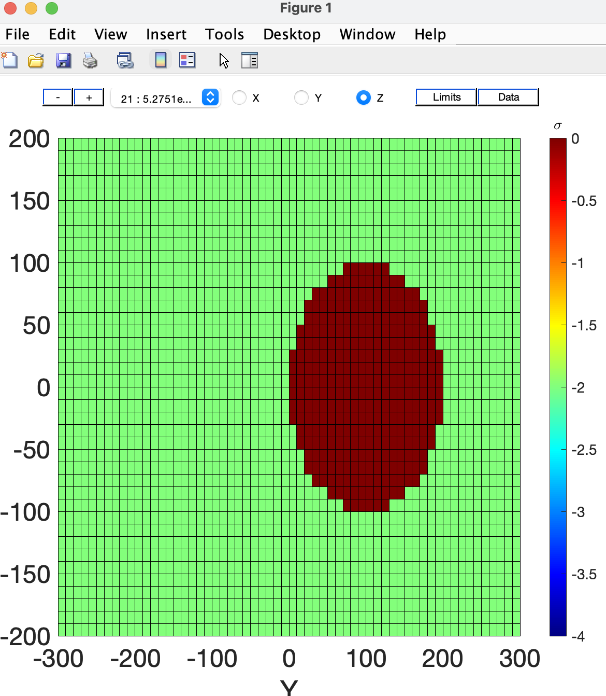

Using MatLab classes to create a synthetic example
==================================================

The MatLab tools associated with the `ModEM-Tools` examples contains classes
which can easily allow us to create both synthetic 

The MatLab examples have tools that can help create both synthetic data and
models. This example will show how to create a synthetic model, and then create
a station data on top of that.

The [ModelPlot][modelplot] portion of the MatLab code contains extensive classes
and functions for manipulating ModEM data and ModEM models. This is not limited
to plotting, despite the name suggests.

# Introduction

Before we begin, you'll need the [MatLab's Mapping Toolbox][Mapping ToolBox] in
order to run the code snippets found in the 
[Creating Data](#creating-data) section.

Likewise, you will need to ensure a number of helper functions and objects in
your MatLab path. You can do this easily by adding the
[ModEM-Tools/matlab/](../matlab/) and all of it's subfolders (Right Click -> Add
To Path -> Selected Folders and Subfolders). This will give you access to all 
classed used in this example, and the classes and functions they use themselves.

If you would like to see just the code for this example, 
[you can find it in this driver script][driver].

[driver]: create_synth_model_and_data_driver.m

## Finding Additional Documentation 

This example is only a limited view of the classes available in the
ModEM-Tools/matlab directory. If you want to do things apart from this you
should use the `help` and `doc` for each classes to get a better idea of their
full functionality:

```matlab
>>> help mtdata
>>> doc mtdata % Opens up MatLab dialog window with full list of methods/properties
```

You may also be interested in checking out adjacent classes to the ones listed
here: `mtperiod`, `llgrid`, `modelplot` etc.

# Creating a Synthetic ModEM Example

The MatLab code contains a few different classes which can assist with creating
models of different types, either x,y grid or a latitude, longitude grid.

TO create a synthetic model we first need to define our grid. We can do that
using either [xygrid][xygrid] or [llgrid][llgrid] classes. `xygrid` and
`llgrid` define the dimensions, air layers, z layers, orientation, and origin
of our grid.

We can then use [xymodel][xymodel] or [llmodel][llmodel] to add conductivity
data to our model, write our model, read our model back in and create plots of
our model.

[xygrid]: ../matlab/matlab/modelParam/xygrid.m
[llgrid]: ../matlab/matlab/modelParam/llgrid.m

[xymodel]: ../matlab/matlab/modelParam/xymodel.m
[llmodel]: ../matlab/matlab/modelParam/llmodel.m

## Creating a Model

Let's use `xygrid` and `xymodel` to create a simple model. First, let's create
our internal dimensions. Our Z dimension will need to be logarithmically
increasing, to create that we can use the static `logz` of xygrid:

```matlab;
>>> dx = 10 * ones(40, 1);
>>> dy = 10 * ones(60, 1);
>>> dz = xygrid.logz(0, 100, 36, 1.2);
Spacing: starts with 0.028256 km
>>> grid = xygrid(dx, dy, dz);
```

The above code snippet creates our internal grid for our model. We will
probably want to add some padding and we can do so by using the `llgrid.pad()`
method of our grid:

```matlab
>>> npad = 4;
>>> grid.pad('NSEW', npad);
```

We can also add additional padding if we choose, by specifying different options for the 
first argument: W(est), E(east), N(orth), S(outh), U(p), Down.

We can also use `xygrid` to create a mask for covariance files. The
documentation for `xygrid.mask` contains more information on the options for
this, so check the help for `xygrid.mask` (i.e.  `>>> help xygrid.mask`).

For now, let's create a cylindrical mask:

```matlab
>>> ind = grid.mask('cylinder', [5 15], [0 100], 100, 5);
```

The above will create a cylindrical mask with mask value 5, on levels 5 through
15 centered at [0, 100] and with a radius of 100.

Now, let's use [xymodel][xymodel] to add conductivity to our grid:

```matlab
>>> sigma = xymodel(grid)
>>> % Create values for sigma:
>>> sigma.v = -2 * ones(grid.nx, grid.ny, grid.nzEearth);
```

We can use either `xymodel.loge()`, `xymodel.log10()`, or `xymodel.linear()` to
set our resistivity type and apply our chosen parameter type to our sigma
values (sigma.v).


For now, we will just rewrite sigma with `LOG10`:

```matlab
>>> sigma = sigma.log10();
```

We can use our mask to set masked cells to a specific value:

```matlab
>>> sigma.v(ind==5) = 1;
```

And then, we can use `xymodel.uiplot()` to open an interactive plot of our
model:

```matlab
>>> sigma.uiplot()
```

<figure>
    
    <figcaption>A screen shot of the UIPlot utility. We can view different layers of the model by selecting
        either x, y or z and then choosing the later with the +/- keys or the drop-down.</figcaption>
</figure>

If our model looks good we can write it out using the write method:

```matlab
>>> sigma.write('example.model.rho', 'WS');
```

One can also create plots by using `xymodel.plot`:

```matlab
>>> sigma.plot('depth',10); delta=1e-6; caxis([-4-delta 0+delta]);
>>> print('-djpeg','-r300',['example_depth_' num2str(10) 'km.jpg']);
```


## Creating Data

> **NOTE:** In order to Run the following section, you will need 
> a license to MatLab's [Mapping Toolbox][Mapping ToolBox].

[Mapping ToolBox]: https://www.mathworks.com/products/mapping.html

Let's now shift our focus to creating data using that MatLab code. We can use
`mtdata` to create data on top of the model we created above. Let's create data
for two different data types.

### Creating a Map Projection

In order to use some methods of `mtdata` we will need to use a map project. The
map projection will as it in translating our data to compute latitude and
longitude of our stations.

First, let's create a map projection. The map projection will assist us in
setting latitude and longitude values for our station locations as we will see
later.

Let's create a Transverse Mercator map projection with an latitude and longitude
origin of [45, -90]:

```matlab
>>> utmstruct = defaultm('tranmerc');
>>> utmstruct.origin = [45 -90 0];
>>> utmstruct.scalefactor = 0.9996;
>>> utmstruct.geoid = almanac('earth', 'wgs84', 'meters');
>>> utmstruct.falseeasting=500000;
>>> mstruct = defaultm(utmstruct);
```

### Creating Period and Station Data

Now that we have a map projection with an origin created, let's create two
`mtdata` objects, one for 'Full_Impedance' and the other for
'Full_Vertical_Components':

```matlab
>>> per = 10.^(0.6:0.6:4);
>>> full_imp = mtdata('Full_Impedance', per, 'xy');
>>> full_vert = mtdata('Full_Vertical_Components', per, 'xy');
```

Examining the above structures, we can see that objects above contain a number
of fields. Most importantly, we can see that they both contain the 6 periods that we
we assigned to `per`:

```matlab
>> full_imp.d

ans =

  1x6 cell array

    {1x1 mtperiod}    {1x1 mtperiod}    {1x1 mtperiod}    {1x1 mtperiod}    {1x1 mtperiod}    {1x1 mtperiod}
>>> % d is a cell array of periods, each containing an mtperiod object:
>>> full_imp.d{1}
ans = 

  mtperiod with properties:

                 T: 3.9811
             Cmplx: 1
             units: '[mV/km]/[nT]'
    signConvention: 1
             nComp: 8
             nSite: 0
           siteLoc: []
          siteChar: []
                TF: []
             TFerr: []
            orient: 0
               lat: []
               lon: []
          compChar: [4x3 char]
     primaryCoords: 'xy'
            txType: 'MT'
              type: 'Full_Impedance'
          nanvalue: 999999
            origin: [0 0 0]
           mstruct: []
        topography: []
        dataErrors: []
          EarthRad: 6.3781e+03
         EarthEcc2: 0.0067
```

As we can see in the above code snippet, `nSite` is set to 0. This is because we
have not defined site or station data yet.

For our synthetic example, we can use `mtdata.gridNodes` or `mtdata.cellNodes` methods.
These methods will allow you to create stations at the location of grid nodes,
or grid cells respectively:

```matlab
>>> full_imp = full_imp.gridNodes(grid, per, 'all', mstruct);
>>> full_vert = full_vert.gridNodes(grid, per, 'all', mstruct);
```

For synthetic examples, this might be advantageous; however, for real data cases
one might want to instead use `mtdata.insertSite` to insert sites manually.

Let's now set the real, imaginary and the error bars all to zero for our data

```matlab
>>> full_imp = zero(full_imp);
>>> full_vert = zero(full_vert);
```

We can now write out our data:

```matlab
>>> full_imp.header = 'Full_Impedance, written out by ModEM-Examples Tutorial';
>>> full_vert.header = 'Full_Vertical_Components, written out by ModEM-Examples Tutorial';
>>>
>>> full_imp.write('data.full_impedance.6per.dat');
>>> full_vert.write('data.full_vert_comp.6per.dat');
```

To combine the two data files into one, you can use a text editor of your
choice. Just ensure you copy both headers of the data types.
